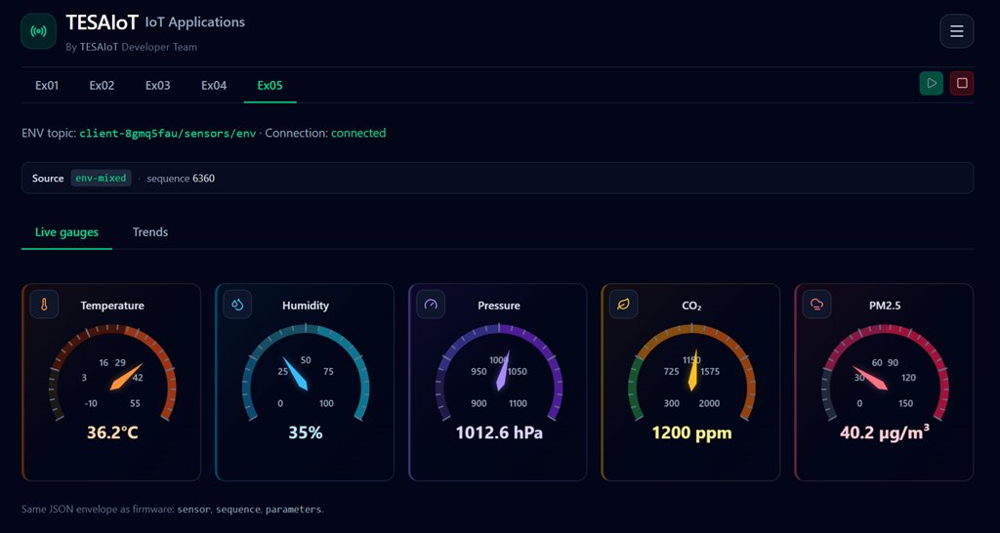

# Bitstream Application - INC343/AUT561/NonDeegree/TESAIoT

[](https://github.com/drsanti/aut561-bitstream-app)
[](./firmware)
[](./frontend)
[](./docs/Tutorial.md)
[](https://nodejs.org/)

---


See the full UI screenshot gallery in [`docs/assets/GALLERY.md`](./docs/assets/GALLERY.md).  
Watch the demo on YouTube: [Demo: Bitstream Application](https://www.youtube.com/watch?v=5Ybb6eFmL5I).

---

Integration of sensor-node firmware (MCU) and React web UI applications:

- `firmware/` (PSoC 6 sensor publisher over MQTT)
- `frontend/` (React dashboard over MQTT WebSockets)
- `docs/` (step-by-step setup and run guide)

> [!TIP]
> New here? Start with **[`docs/Tutorial.md`](./docs/Tutorial.md)**.

> [!IMPORTANT]
> Before starting this repository, be sure you have already passed/completed the experiment in **[`drsanti/ps6-mqtt-sensors`](https://github.com/drsanti/ps6-mqtt-sensors)**.

## Workspace Layout

```text
ps6-ws/
├─ firmware/    # PSoC 6 app (ModusToolbox)
├─ frontend/    # React + Vite dashboard
├─ docs/        # Tutorial and screenshots
└─ services-tools/  # local dev CLI source (ignored in this repo)
```

## Quick Start

1. Install prerequisites:
   - [Git](https://git-scm.com/)
   - [Node.js 20+](https://nodejs.org/)
   - [ModusToolbox](https://www.infineon.com/design-resources/development-tools/sdk/modustoolbox-software) (for firmware build/program)
2. Follow **[`docs/Tutorial.md`](./docs/Tutorial.md)** from top to bottom.

## What This Repo Tracks

This repository is intentionally scoped to the main learning artifacts:

- `firmware/`
- `frontend/`
- `docs/`
- root docs/files such as this `README.md`

Auxiliary workspace folders (like `services-tools/`, `mtb_shared/`, and local runtime files) are ignored by `.gitignore`.

<details>
<summary><strong>Notes for Contributors</strong></summary>

- Keep command examples in docs aligned with current CLI names (for example `bitstream simulator start`).
- Prefer relative links (`./docs/Tutorial.md`) so docs work both locally and on GitHub.
- If you update setup steps, also update related screenshots under `docs/assets/`.

</details>
