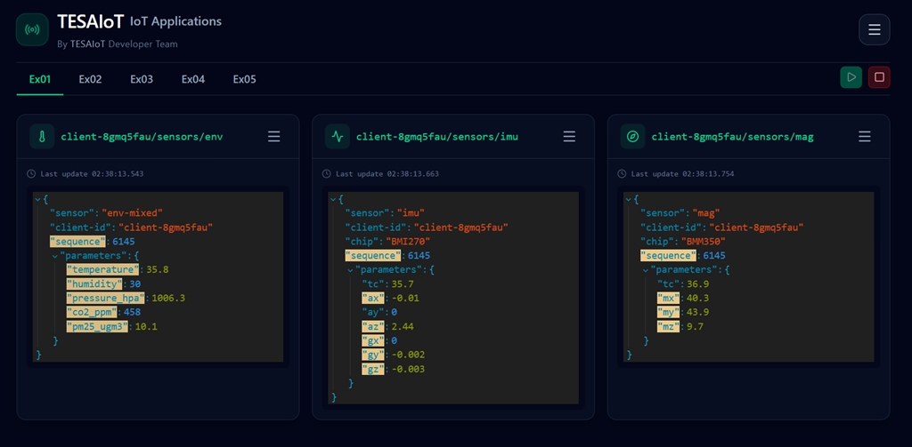
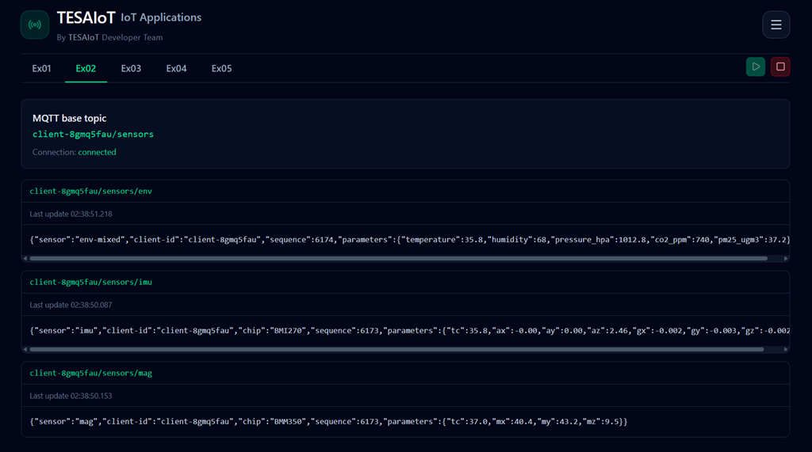
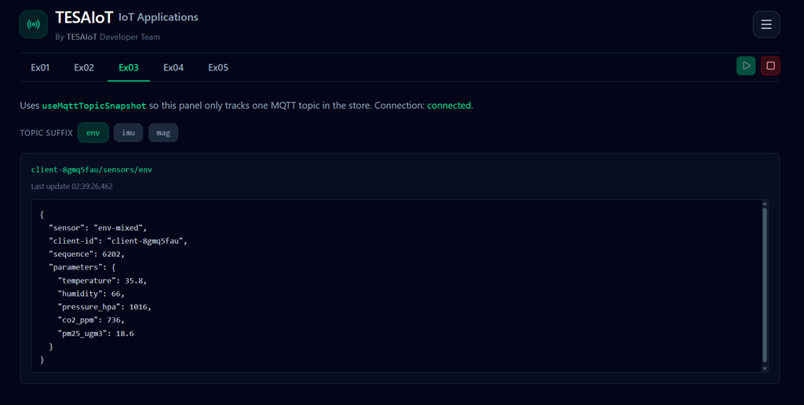
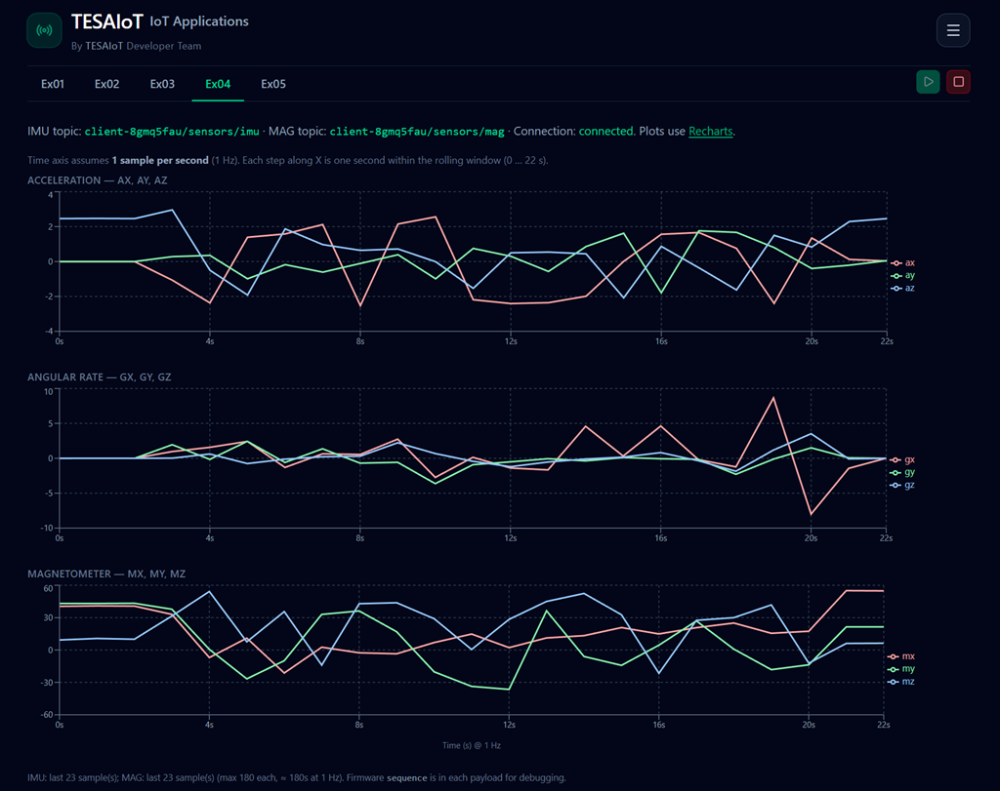
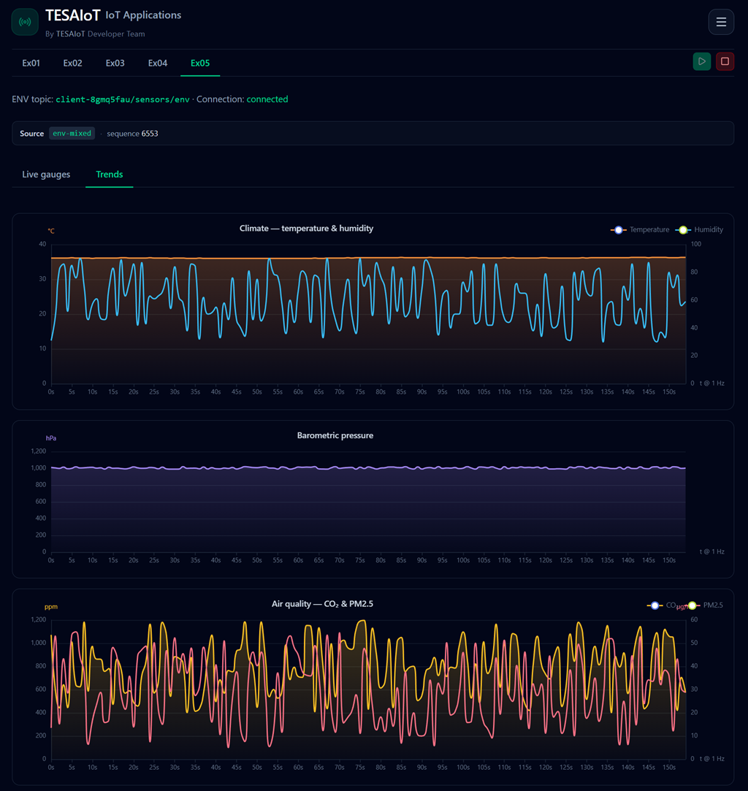

# Getting started: firmware and frontend application

This tutorial is for beginners who want to run the **PSoC 6 MQTT sensors firmware** and the **React-based frontend application** together. You will use a single command-line tool, **Bitstream** to configure Wi‑Fi and MQTT settings, optionally start a local broker, and align the frontend application with the same broker and topic layout as the firmware.

The workspace is organized as three main projects:

- **bitstream** CLI: patch `firmware/configs/mqtt_client_config.h` and `wifi_config.h`, sync the frontend `.env`, run an embedded MQTT broker or Docker Mosquitto helpers, simulate sensor traffic without hardware, and wrap common ModusToolbox `make` steps.
- **`firmware`** — the ModusToolbox application for the **CY8CKIT-062S2-AI** kit: connects over Wi‑Fi and publishes JSON telemetry on MQTT topics derived from **`MQTT_BASE_TOPIC`**.
- **`frontend`** — the **React** application: connects to the broker over **WebSockets** and visualizes the same telemetry shapes the firmware publishes.

> [!WARNING]
> Users must download and install Git from `https://git-scm.com/` beforehand.
>
> Users must also install **Node.js** version **20** or newer from `https://nodejs.org/` beforehand. In Git Bash, verify with `node --version`.
>
> **ModusToolbox** must be installed and working correctly so firmware **`make`** commands (for example **`bitstream fw getlibs`**) can run. Install from Infineon: [ModusToolbox software](https://www.infineon.com/design-resources/development-tools/sdk/modustoolbox-software).

## Install Git

1. Download the installer for your operating system from the official Git website: [https://git-scm.com/](https://git-scm.com/).
2. Run the installer and accept the defaults unless your organization requires specific options.
3. On **Windows**, this tutorial assumes you use **Git Bash** (installed with Git) for the shell commands in later sections, so paths and quoting match what we document.

## Install Bitstream

Install the **Bitstream** CLI globally from the npm registry (Git Bash or any terminal where `npm` is on your `PATH`):

```bash
npm install -g @ternion/bitstream
```

After installation, you can run **`bitstream`** from any directory. Check that it works with **`bitstream --version`**; a printed version means the install succeeded.

## Download `firmware` and `frontend`

1. Open the repository: [drsanti/bitstream-app](https://github.com/drsanti/bitstream-app).
2. Click **Code** → **Download ZIP** and save the archive.
3. Extract the ZIP to a folder that will be your workspace **ROOT** (the directory you will `cd` into later). Pick any short path without spaces if you can. Examples: **Windows** — **`C:\bitstream-app`** (in Git Bash use **`/c/bitstream-app`**). **macOS** — e.g. **`~/bitstream-app`** or **`/Users/<yourname>/bitstream-app`** in Terminal.

**ROOT** must be the folder that **directly** contains **`firmware/`** and **`frontend/`**. If extraction created an extra level (for example `bitstream-app-main`), either `cd` into that folder and treat it as **ROOT**, or move `firmware` and `frontend` up so they sit immediately inside your chosen **ROOT**.

## Initialize the project

In a terminal, go to your workspace **ROOT** (the folder that contains **`firmware/`** and **`frontend/`**), then run Bitstream’s workspace setup:

```bash
cd /c/bitstream-app
bitstream init default --force
```

Use your real **ROOT** path instead of `/c/bitstream-app` (same folder you chose when extracting the ZIP). On macOS, that might look like `cd ~/bitstream-app`.

**`bitstream init default`** creates **`bitstream.config.json`** in **ROOT** so Bitstream knows where the firmware headers and frontend live. If the layout is wrong, the command prints errors and exits; fix paths or folder names until it succeeds.

Then run:

```bash
bitstream config validate
```

This checks that the paths in **`bitstream.config.json`** are readable and consistent.

## Initialize the firmware project

From your workspace **ROOT** (where **`bitstream.config.json`** was created), fetch ModusToolbox libraries into the firmware tree:

```bash
bitstream fw getlibs
```

This wraps **`make getlibs`** in **`firmware/`**. Run it once on a new copy of the project, or whenever you need to refresh dependencies. It requires **ModusToolbox** and **`make`** on your **`PATH`**, the same as building the firmware in the ModusToolbox environment.

> [!NOTE]
> `bitstream fw getlibs` may take about **2-5 minutes** (or longer) depending on your internet speed. Wait until the command finishes completely.

## Compile the firmware

From workspace **ROOT**, compile the firmware (same as **`make build`** in **`firmware/`**):

```bash
bitstream fw build
```

Optional: speed up the build with parallel jobs, for example **`-j 8`**:

```bash
bitstream fw build -j 8
```

The **`-j`** / **`--jobs`** value must be a positive integer (omit it if you are unsure).

## Program the firmware

Connect the **CY8CKIT-062S2-AI** over USB (KitProg3). From **ROOT**, flash the image to the MCU:

```bash
bitstream fw program
```

You can pass the same **`-j <n>`** option as for the build step if your ModusToolbox flow benefits from it.

If programming fails with a CMSIS-DAP or probe error, check the USB cable, link mode on the board, and that no other tool is using the debugger. See the **firmware** `README.md` for more troubleshooting hints.

## Start the embedded MQTT broker

Bitstream can run a small **MQTT broker** on your PC (**TCP** for the kit, **WebSockets** for the browser dashboard). Defaults are **TCP `1883`** and **WebSocket `9001`** (path **`/mqtt`** for clients such as the frontend).

In a terminal (from **ROOT** or anywhere), start the broker in the **foreground** (this process keeps the broker running until you stop it):

```bash
bitstream broker start
```

**Stop (foreground):** Press **Ctrl+C** in the same terminal.

To run it in the **background** instead:

```bash
bitstream broker start --daemon
bitstream broker status
```

**Stop (daemon / background):** With **`--daemon`**, **Ctrl+C** does not stop the broker (that shell only started the background job). Stop it with:

If the broker cannot start because ports are already taken, you can force-release ports with:

- **`bitstream port kill 1883 --force`** (MQTT TCP)
- **`bitstream port kill 9001 --force`** (MQTT WebSocket)

```bash
bitstream broker stop
```

If **1883** or **9001** are already in use, free them or pick other ports (see **`bitstream broker start --help`**). Ensure **`mqtt_client_config.h`** uses a broker address the board can reach (for this PC’s broker, that is usually your machine’s **LAN IPv4**, not `127.0.0.1` on the device).

## Start the simulator (no hardware)

If you **do not** have the physical kit (MCU board), you can still exercise the **frontend** by publishing the same **JSON** shapes as the firmware over MQTT. **Leave a broker running** on your PC before you start the simulator—for example the one from [Start the embedded MQTT broker](#start-the-embedded-mqtt-broker)—then run:

```bash
bitstream simulator start
```

**Stop (foreground):** Press **Ctrl+C** in the same terminal where the simulator is running.

With **no** broker or base-topic flags, this is the same as **`bitstream simulator start --broker-auto --base-topic-auto`**: **LAN IPv4** for the broker and **`MQTT_BASE_TOPIC`** from **`firmware/configs/mqtt_client_config.h`**. You can still pass **`--broker <host>`**, **`--base-topic <prefix>`**, **`--broker-auto`**, or **`--base-topic-auto`** when you need to override only one side—in that case the other can fall back to **`mqtt_client_config.snapshot.json`** (refresh with **`bitstream mqtt-broker snapshot`** from **ROOT** if needed).

Run in the **background** while you use the dashboard:

```bash
bitstream simulator start --daemon
bitstream simulator status
```

**Stop (daemon / background):** When you started the simulator with **`--daemon`**, **`Ctrl+C` does not stop it** (that terminal only launched the background job). Stop it with:

```bash
bitstream simulator stop
```

## Stop all processes

> [!NOTE]
> If you still want to use the **frontend** (dashboard) with MQTT, **do not stop the embedded broker**—the UI needs a broker that matches your WebSocket settings.
>
> If you are **not** using the real MCU board and the **MCU simulator** is what publishes sensor data for the UI, **do not stop the simulator** until you are done with that no-hardware workflow.

When you are **fully** finished—or you need **TCP 1883** / **WebSocket 9001** free for something else—shut down Bitstream’s **embedded MQTT broker** and/or **MCU simulator** as below.

**If you used daemon / background mode** (MCU simulator with **`--daemon`**, broker with **`bitstream broker start --daemon`**), run:

```bash
bitstream simulator stop
bitstream broker stop
```

Order is not critical; stop whichever you started.

**If you ran the broker or simulator in the foreground** (no **`--daemon`**), switch to the terminal where each is running and press **Ctrl+C**—there is nothing to `stop` for those foreground processes.

You can confirm they are down with **`bitstream simulator status`** and **`bitstream broker status`**.

---

## Install frontend dependencies

In a new terminal, go to **`frontend`** and install npm packages:

```bash
cd frontend
npm install
```

Start the development server:

```bash
npm run dev
```

> [!WARNING]
> The MQTT broker must be running before you expect live data in the frontend.
> Start one with **`bitstream broker start`** (foreground) or **`bitstream broker start --daemon`** (background).

Open the local URL printed by Vite (usually **`http://localhost:5173`**).

For live telemetry on the dashboard, keep these running:

- a broker (for example **`bitstream broker start`** or **`bitstream broker start --daemon`**)
- a publisher (**real board** or **`bitstream simulator start`**)

#










